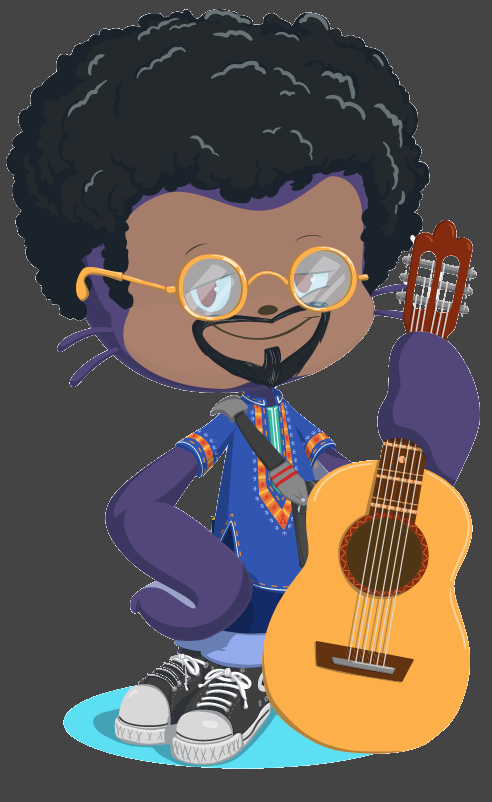
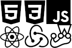

[__Português brasileiro__](#pt-language) | [__English__](#en-language) | [__Français__](#fr-language)

## <a name="pt-language">Oi, eu sou o Lucas</a>
### :computer: Desenvolvedor Front-End/Frontend :computer:
***

#### Sobre mim :octocat:
- Meu nome é Lucas, mas pode me chamar de Bardo;
- Desenvolvedor Front-End/Frontend em formação pela _**Trybe**_;
- Atualmente estudando **React** e gerenciamento de estado com **Redux/Context API**;
- Gosto muito de CSS puro;
- Querendo contribuir com a comunidade open-source de JavaScript;
- Eu gosto bastante de Ruby :heart::heart::heart:
- Nas horas vagas, escrevo música. :musical_score:
- Sou viciado em queijo.

#### Tecnologias principais

##### Conhecimentos adicionais (nível básico - intermediário)
- Angular
- Next.js
- Express
- Java
- Ruby

P.S.: A lista não está em ordem de nível de conhecimento.

#### Fale comigo
- [Linkedin](https://www.linkedin.com/in/lucasmribeiro7)
- [Github](https://www.github.com/1ribeirolucas)
- [Instagram](https://www.instagram.com/devpreto)
- [Portfolio](https://1ribeirolucas.vercel.app)

Baseado em vários READMEs [deste repositório](https://github.com/kautukkundan/Awesome-Profile-README-templates). Desculpa, listar todo mundo aqui vai ocupar muito espaço.

Ícones por [Simple Icons](https://simpleicons.org)

***
## <a name="en-language">Hi, I'm Lucas</a>
### :computer: Front-end/Frontend Developer :computer:
***
**Work in progress.**

Make yourself at home and grab a drink. We got beers!

***
## <a name="fr-language">Salut, je suis Lucas</a>
### :computer: Développeur Front-End/Frontend :computer:
***
**Travail on cours.**

En attendant, prenez un verre et installez-vouz. Nous avons de la bière!
